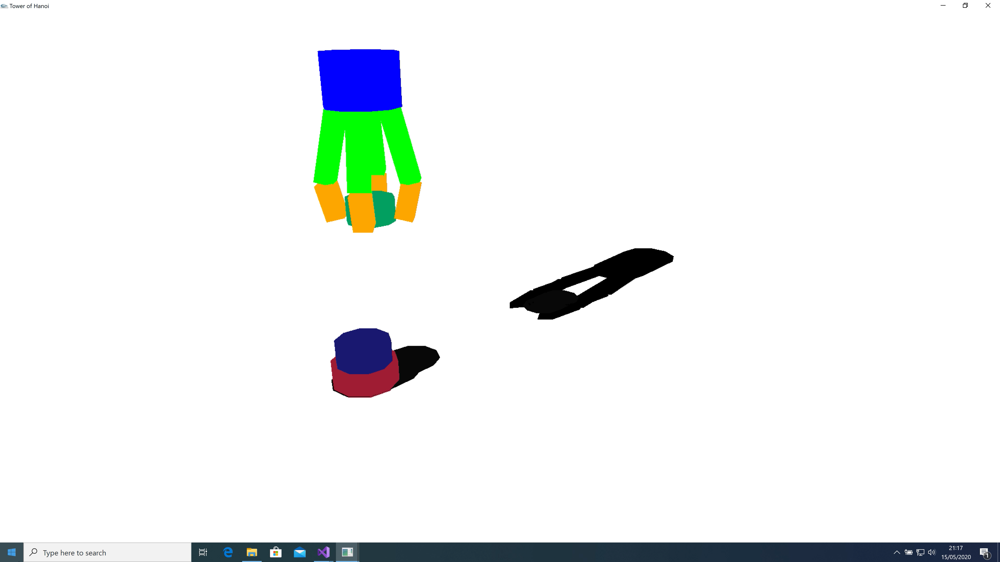
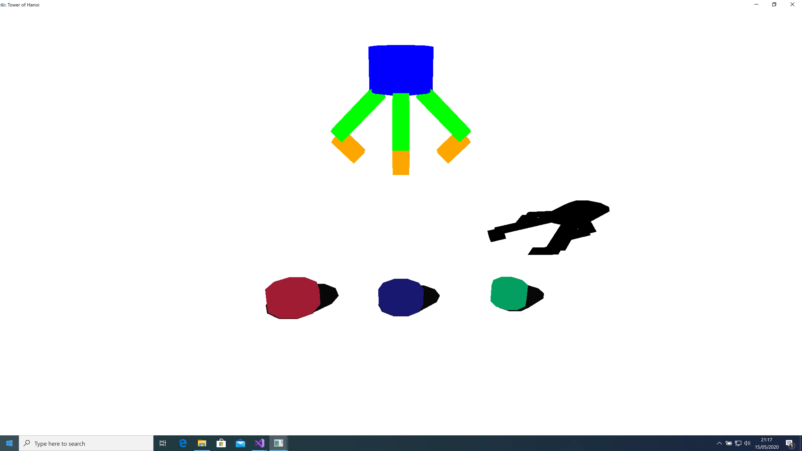
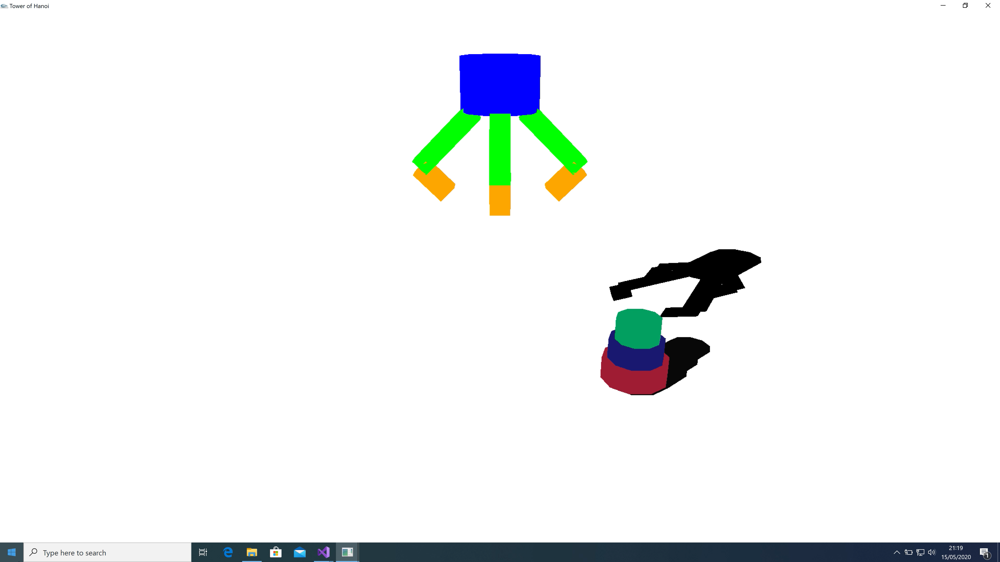

## Topic:

Tower of Hanoi

## Dependency:

OpenGL (glut)

## Description:

This is a final group project of EE4208 - Computer Graphics for
Engineers at City University of Hong Kong

The animation is written in C++ with OpenGL.

The video of the final product is also upload to this repository named
as Demo.mov.

## Motivation:

The original motivation to make an animation regarding is to use it as a
demo of what is Tower of Hanoi since it is used as an example of how
'recursion' works in the course Data structure and Algorithms, which I
was one of the TAs at that time.

## Preview:

